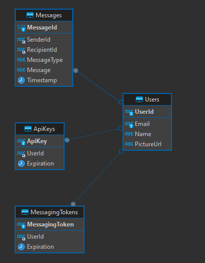

# Bober Chat - Server

## Introduction
Welcome to the README for the server repository of the [Android chat application](https://github.com/Mark7888/bober-chat-client) developed for the complex assignment for 'Mobile Programing' university course. This repository contains the backend server implemented in Python using Flask with Gunicorn WSGI worker. It handles client-server authentication, database connections, and other backend functionalities. The server utilizes Firebase Admin SDK for authentication, MySQL Connector for database connections, and Docker for containerization.

## Setup
To set up the server, follow these steps:

1. **Firebase Admin SDK**: Download the Firebase Admin SDK JSON file and place it in the root of the server folder. Rename the file to `serviceAccountKey.json`.

2. **Environment Variables**:
   - Copy the `.env.dist` file to `.env`.
   - Fill in the required data in the `.env` file, such as database connection details and Firebase configuration.

3. **Docker**:
   - Make sure Docker is installed on your system.
   - Run `docker-compose up -d --build` to build and start the server container.

## Usage
Once the server is set up and running, it will handle client requests from the Android application. The server facilitates authentication, message handling, and database operations.

## Connecting Application to Domain
To connect the Android application to the server running on a domain, follow these steps:

1. **Update ConnectionHandler.kt**: In the Android application repository, navigate to the (ConnectionHandler.kt)[https://github.com/Mark7888/bober-chat-client/blob/master/app/src/main/java/me/mark7888/boberchat/ConnectionHandler.kt#L18] file.
   - Update the domain name or server URL in this file to point to your server's domain.

## Database Structure

## Dependencies
- Python
- Flask
- Gunicorn
- Firebase Admin SDK
- MySQL Connector for Python
- Docker

## Issues and Support
For any issues or support requests related to the server, please open an issue in the GitHub repository.

## License
This project is licensed under the [MIT License](LICENSE).
